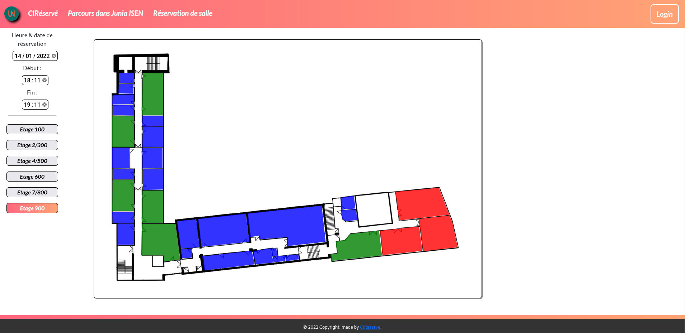

# CIReserve

Small project made in one week that aims to create a website (and maybe apps ?) to check if classes are available to book in our school.

A video of the project is available at this **[link](https://youtu.be/O1B8IpH0_hU)**

---

## Run the project:

First run `npm install` to setup the project, then `npm start` to start the [Express](https://expressjs.com/) webserver

---

## Build the front-end

Run `ng build` to generate a static site in `dist/cireserve`.

---

## Built with
- [angular cli](https://github.com/angular/angular-cli) to cross compile etc
- [MongoDB](https://www.mongodb.com) to run the database
- [notify](https://notiflix.github.io/notify) in order to show some sweet notification
- [express](https://www.npmjs.com/package/express) to run the back-end serv
- [bcryptjs](https://www.npmjs.com/package/bcryptjs) to hash users passwords
- [momentjs](https://momentjs.com/) to ease the use of `Date` and locales

*A more detailed list is available in `package.json`*

---

## Generate documentation
Run `jsdoc -d ./doc --readme README.md -c jsdoc.json -r --verbose`, this will generate documentation in `./doc` folder.
